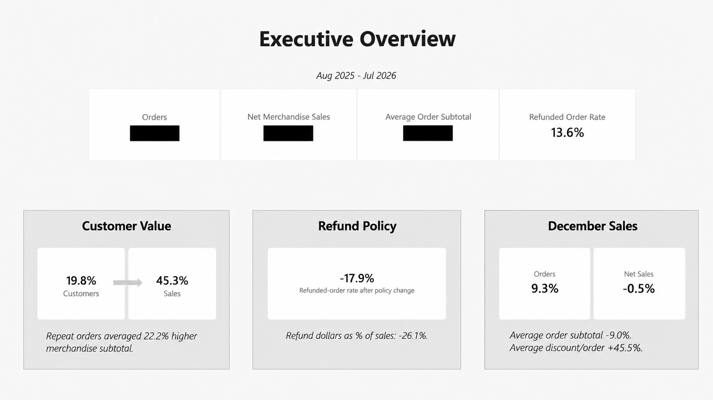
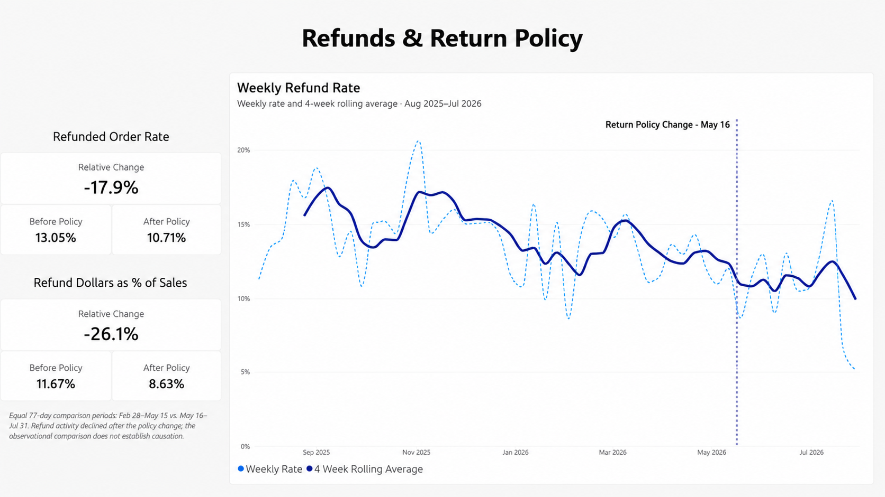
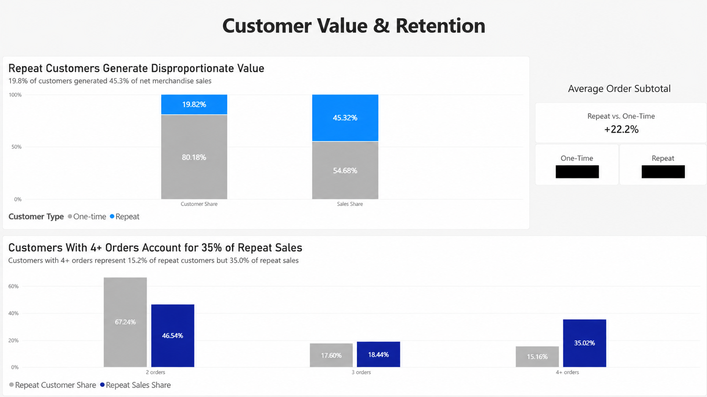
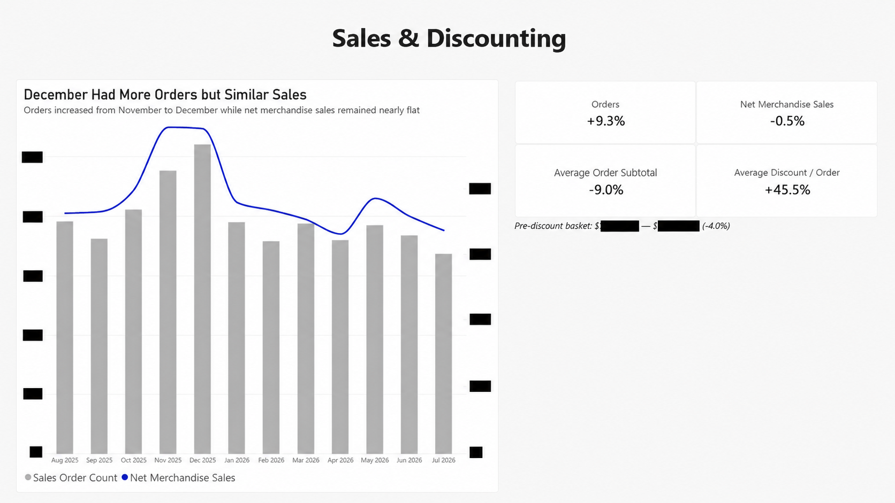
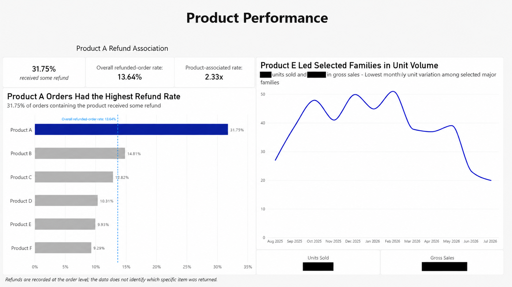

# Shopify E-Commerce Analysis
### Python, Pandas & Power BI

## Project Overview
This project analyzes one year of Shopify order data from August 2025-July 2026. The analysis covers 9,499 orders and was conducted using python and pandas before being prepared for reporting in Power BI. This public portfolio version has been sanitized to protect confidential company and customer information.

The analysis focuses on sales and discount trends, customer purchasing behavior, product performance, geographic patterns, and refunds. Extra attention was given to changes in refund activity following a return policy change in May 2026.

The final deliverables include a reproducible Jupyter notebook and a five-page Power BI report that communicates the most important findings at both an executive and detailed level.

## Business Questions

- **Practical question #1:** "Did the return-policy change work? Did refunds go down?"
- **Analytical equivalent:** "Did refund behavior change following the May 2026 return-policy update?"
  
  ---

- **Practical question #2:** "Which product lines sell the best? Which gets returned the most?"
- **Analytical equivalent:** "Which major product families generate the strongest sales performance and refund activity?"
  
  ---

- **Practical question #3:** "How's the company doing this year?"
- **Analytical equivalent:** "How did sales, order volume, and discounting change over the analysis period?"

  ---

- **Practical question #4:** "Do we get more new or repeat customers? Who spends more?"
- **Analytical equivalent:** "How do one-time and repeat customers differ in purchasing behavior and value?"

  ---

- **Practical question #5:** "Where are our customers from?"
- **Analytical equivalent:** "Are there geographic patterns in customer purchasing?"

## Tools Used
- Python: data cleaning, validation, exploratory analysis, CSV export preparation
- Pandas/Numpy: aggregation, feature creation, customer segmenting, product segmenting, metric calculations
- Jupyter Notebook: reproducible analysis workflow and documentation
- Power BI: data modeling, DAX measures, dashboard design, and final reporting

## Analysis Workflow

1. Cleaned and validated raw Shopify order and line-item data.
2. Created reusable customer, product, sales, and refund features.
3. Restricted to August 2025 - July 2026.
4. Analyzed overall business performance, product performance, refunds, monthly sales, discount trends, customer behavior, and geography.
5. Compared symmetric 77-day periods before and after the May 2026 return policy change.
6. Prepared reporting tables for Power BI and built a dashboard report on the strongest findings.

## Key Findings

- Repeat customers represented 19.8% of customers but generated 45.3% of customer-attributed sales. Their average order subtotal was also about 22% higher than one-time customers.

- Orders increased 9.3% from November to December 2025, while net merchandise sales remained nearly flat (-0.5%). Average order subtotal fell 9.0% and average discounts increased 45.5%.

- About 31.8% of orders containing Product A received some refund, compared with an overall refunded-order rate of about 13.6%.

- Across equal 77-day periods, the refunded-order rate fell from about 13.0% to 10.7%, a 17.9% relative decline. Refund dollars relative to merchandise sales fell about 26.1%, although the broader downward trend means the policy cannot be treated as the sole cause.

## Power BI Report

The analysis was built into a five-page Power BI report to present the strongest findings at both an executive and detailed level.

The report includes:
- Executive Overview
- Refunds & Return Policy
- Customer Value & Retention
- Sales & Discounting
- Product Performance

The Power BI model uses a dedicated calendar table and separate reporting tables for refund, customer, sales, and product analysis (exported from section 10 of the analysis notebook). DAX measures were used for KPIs, period comparisons, and rolling refund metrics.

Public screenshots have been anonymized and redacted to preserve the report design while protecting confidential business information.

### Executive Overview

### Refunds & Return Policy

### Customer Value & Retention

### Sales & Discounting

### Product Performance

## Repository Contents

- `README.md` — project overview, methodology, key findings, and Power BI report.
- `notebooks/shopify_analysis.ipynb` — redacted/sanitized public version of python/pandas analysis and Power BI export preparation.
- `images/` — screenshots of the five-page Power BI report.
- `data/README.md` — explanation of the source data and why the original dataset is not publicly included.

## Data Privacy

This project uses real Shopify data from a private business. To protect company and customer information, the original dataset and customer-level exports are not included in this repository.

Only aggregated findings, analysis code, and report screenshots are presented publicly. Any identifying customer information has been excluded from the portfolio materials.
